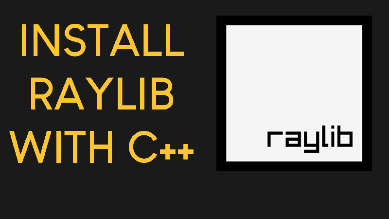

# DSA Visualization — Project CS163

An interactive **Data Structure & Algorithm Visualization** tool built with C++ and [raylib](https://www.raylib.com/). Step through operations on linked lists, hash tables, trees, and graphs with real-time animations and highlighted pseudocode.



## Features

- **Step-by-step playback** — Play, Pause, Replay, and adjust speed while an operation executes.
- **Interactive operations** — Insert, Delete, and Search through on-screen buttons or file input.
- **Code highlighting** — Algorithm pseudocode is displayed alongside the visualization with the current step highlighted.
- **Dark / Light theme** — Switch themes at any time from the main menu.
- **Sample data files** — Load pre-made datasets from the `Sample/` directory via a file dialog.

## Supported Data Structures

| Category | Structures |
|---|---|
| **Linked List** | Singly Linked List (insert, delete, search) |
| **Hash Table** | Hash Table with linear probing |
| **Trees** | AVL Tree · 2-3-4 Tree · Trie · Max Heap |
| **Graph** | Undirected weighted graph · Connected components · Minimum Spanning Tree (Kruskal) |

## Prerequisites

- **C++ compiler** with C++14 support (g++ or clang++)
- **raylib 4.5.0** — see the [raylib wiki](https://github.com/raysan5/raylib/wiki) for installation instructions
- **Make** (mingw32-make on Windows, make on Linux/macOS)

## Building

```bash
# Clone the repository
git clone https://github.com/BearSunny/Project_CS163.git
cd Project_CS163

# Build (Linux / macOS)
make

# Build (Windows with MinGW / raylib w64devkit)
mingw32-make
```

The resulting executable is named `game` (or `game.exe` on Windows).

## Usage

```bash
./game          # Linux / macOS
game.exe        # Windows
```

From the main menu, select a data structure to visualize. Use the on-screen buttons to perform operations or load data from the `Sample/` directory.

## Project Structure

```
Project_CS163/
├── main.cpp                # Application entry point and screen routing
├── Makefile                # Build configuration (Desktop / RPI / Web)
├── header/                 # Header files
│   ├── declare.h           # Global declarations, themes, enums
│   ├── mainmenu.h          # Main menu screen
│   ├── LinkedList.h        # Linked List data structure
│   ├── LinkedListVisualizer.h / linkedlistvisual.h
│   ├── HashTable.h / HashTableVisual.h / hashvisual.h
│   ├── treevisual.h        # AVL, 2-3-4 Tree, Trie, Max Heap
│   ├── graphvisual.h       # Graph visualization & algorithms
│   ├── GraphButton.h / HashButton.h / InputField.h  # UI components
│   └── Step.h              # Step tracking for playback
├── source/                 # Implementation files (.cpp)
├── asset/                  # UI icons and menu images (PNG)
├── Font/                   # Fonts (SF Pro Display, Montserrat)
├── Sample/                 # Sample input files
│   ├── Graph.txt           # 10×10 weighted adjacency matrix
│   └── HashTable.txt       # Hash table test data
├── preview.jpg             # Project preview image
└── LICENSE.txt             # MIT License
```

## License

This project is released under the [MIT License](LICENSE.txt).